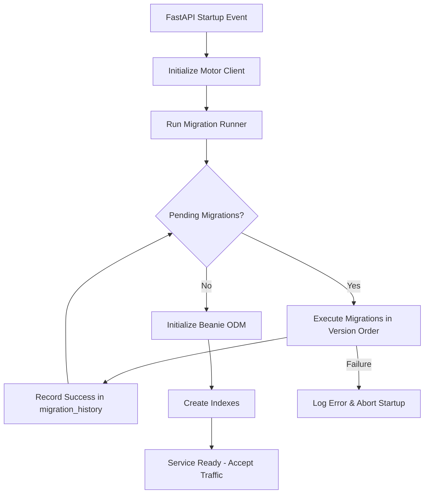

# Design Document: Data Migration System

## Overview

This design introduces a lightweight, custom database migration system for the GlobeCo Security Service. The system discovers and executes versioned migration scripts during the FastAPI startup event, tracking applied migrations in a dedicated MongoDB collection (`migration_history`). The first migration seeds the database with 1 SecurityType ("CS" / Common Stock) and 505 Security records loaded from a JSON data file.

The design replaces the existing `mongo-migrate` dependency with purpose-built code that integrates directly with the existing Motor/Beanie stack and runs within the same async startup flow.

### Design Decisions

1. **Custom over library**: The migration needs are simple (run-once ordered scripts), making a third-party library unnecessary overhead.
2. **Collection-based tracking**: Using a `migration_history` collection is idiomatic for MongoDB and avoids file-system state.
3. **Startup-blocking execution**: Migrations run before Beanie initialization completes and before routes are registered, guaranteeing data consistency when the first request arrives.
4. **JSON seed file**: Keeping the 505-record dataset in a JSON file separates data from logic and makes it easy to verify/update the seed data independently.

## Architecture



The migration runner operates at the Motor driver level (raw collections), not Beanie, because Beanie document models may not yet exist or may have changed between migrations. This keeps migrations decoupled from the ODM layer.

## Components and Interfaces

### 1. Migration Runner (`app/migrations/runner.py`)

The orchestrator that discovers, filters, and executes migrations.

```python
async def run_migrations(db: AsyncIOMotorDatabase) -> None:
    """
    Discover all registered migrations, skip already-applied ones,
    and execute pending migrations in version order.
    Raises MigrationError on failure, which prevents service startup.
    """
```

**Responsibilities:**
- Query `migration_history` collection for applied migration names
- Discover registered migrations from the migration registry
- Filter out already-applied migrations
- Execute pending migrations in sorted version order
- Write a `MigrationRecord` on success
- Raise on failure (causing the startup to abort)

### 2. Migration Registry (`app/migrations/__init__.py`)

A simple ordered list of migration descriptors:

```python
MIGRATIONS: list[MigrationDescriptor] = [
    MigrationDescriptor(version="V001", name="seed_security_data", fn=seed_security_data),
]
```

New migrations are appended to this list. The `version` field determines execution order (lexicographic sort).

### 3. Migration Record Model (`app/migrations/models.py`)

A lightweight dataclass/TypedDict representing documents in `migration_history`:

```python
@dataclass
class MigrationRecord:
    name: str            # e.g. "V001_seed_security_data"
    applied_at: datetime # UTC timestamp of successful execution
    status: str          # "success"
```

### 4. Seed Migration (`app/migrations/v001_seed_security_data.py`)

The first migration function:

```python
async def seed_security_data(db: AsyncIOMotorDatabase) -> None:
    """
    1. Insert a SecurityType document (abbreviation="CS", description="Common Stock", version=1)
    2. Read security data from JSON file
    3. Insert 505 Security documents with security_type_id pointing to the created SecurityType
    """
```

### 5. Seed Data File (`app/migrations/data/securities.json`)

A JSON array of objects, each with `ticker` and `description` fields. The `security_type_id` and `version` fields are applied at migration time, not stored in the JSON.

```json
[
  {"ticker": "AAPL", "description": "Apple Inc."},
  {"ticker": "MSFT", "description": "Microsoft Corporation"},
  ...
]
```

### 6. Updated Startup (`app/main.py`)

The `on_startup()` function is modified to call `run_migrations(db)` before `init_beanie()`:

```python
@app.on_event("startup")
async def on_startup():
    client = AsyncIOMotorClient(settings.MONGODB_URI, ...)
    db = client[settings.MONGODB_DB]
    
    # Run migrations BEFORE Beanie init
    await run_migrations(db)
    
    # Then initialize Beanie as before
    await init_beanie(database=db, document_models=[SecurityType, Security])
    ...
```

## Data Models

### migration_history Collection Schema

| Field        | Type     | Description                              |
|-------------|----------|------------------------------------------|
| `name`      | string   | Unique migration identifier (e.g. "V001_seed_security_data") |
| `applied_at`| datetime | UTC timestamp when migration completed   |
| `status`    | string   | Always "success" (failed migrations are not recorded) |

**Index:** Unique index on `name` to prevent duplicate application.

### Seed Data Structure (securities.json)

```json
[
  {
    "ticker": "AAPL",
    "description": "Apple Inc."
  }
]
```

505 entries total. The `security_type_id` and `version` fields are injected by the migration logic at runtime.

### Existing Collections (unchanged)

- **securityType**: `{abbreviation: str, description: str, version: int}`
- **security**: `{ticker: str, description: str, security_type_id: ObjectId, version: int}`


## Correctness Properties

*A property is a characteristic or behavior that should hold true across all valid executions of a system — essentially, a formal statement about what the system should do. Properties serve as the bridge between human-readable specifications and machine-verifiable correctness guarantees.*

### Property 1: Migration record correctness

*For any* migration function that completes without raising an exception, the `migration_history` collection SHALL contain a document with the migration's name, a `status` of "success", and an `applied_at` timestamp that is a valid UTC datetime.

**Validates: Requirements 2.1, 2.2**

### Property 2: Idempotent skip of applied migrations

*For any* set of migrations where a subset has corresponding "success" records in `migration_history`, re-running the migration runner SHALL execute only the migrations that do NOT have existing records — the already-applied migrations' functions are never called.

**Validates: Requirements 2.3, 2.4, 4.1**

### Property 3: Version-ordered execution

*For any* set of pending migrations with distinct version strings, the migration runner SHALL execute them in lexicographic order of their version field. That is, for migrations with versions V_i and V_j where V_i < V_j lexicographically, V_i always executes before V_j.

**Validates: Requirements 3.2**

### Property 4: Failure propagation

*For any* migration function that raises an exception during execution, the migration runner SHALL propagate the error (raise `MigrationError`) and SHALL NOT record a success entry in `migration_history` for that migration.

**Validates: Requirements 3.3**

### Property 5: Seed data referential integrity

*For all* Security documents created by the seed migration, each document SHALL have a non-empty `ticker`, a non-empty `description`, a `version` equal to 1, and a `security_type_id` that matches the `_id` of the SecurityType document created in the same migration execution.

**Validates: Requirements 6.2, 6.3, 6.4, 7.2**

## Error Handling

| Scenario | Behavior | Recovery |
|----------|----------|----------|
| MongoDB unreachable at startup | Motor client raises `ServerSelectionTimeoutError` | Service fails to start; Kubernetes restarts the pod |
| Migration function raises exception | `run_migrations()` raises `MigrationError` wrapping the original exception | Service fails to start; operator inspects logs |
| Duplicate migration name in registry | Unique index on `migration_history.name` prevents double-write | Should never happen — caught by code review/tests |
| JSON data file missing or malformed | Seed migration raises `FileNotFoundError` or `json.JSONDecodeError` | Treated as migration failure — service aborts startup |
| SecurityType insert fails | Seed migration aborts before inserting Security records (no partial state) | Treated as migration failure — service aborts startup |
| Partial Security insert failure | Migration does NOT use a transaction (MongoDB single-node); on retry the entire seed migration re-runs since no success record was written | Acceptable: insert is idempotent if the collection is empty on retry, and if partially populated the migration can use `insert_many` which is atomic per batch |

### MigrationError Exception

```python
class MigrationError(Exception):
    """Raised when a migration fails, preventing service startup."""
    def __init__(self, migration_name: str, cause: Exception):
        self.migration_name = migration_name
        self.cause = cause
        super().__init__(f"Migration '{migration_name}' failed: {cause}")
```

## Testing Strategy

### Unit Tests (example-based)

| Test | Validates |
|------|-----------|
| `pyproject.toml` does not contain `mongo-migrate` | Req 1.1, 1.2 |
| Seed migration creates exactly 1 SecurityType with abbreviation "CS" | Req 5.1 |
| Seed migration creates exactly 505 Security records | Req 6.1 |
| Re-running startup after seed migration does not create duplicate records | Req 5.2 |
| If SecurityType insert fails, no Security documents are created | Req 7.1, 7.3 |
| Migrations complete before HTTP routes are reachable (integration) | Req 3.1 |
| Migration check with all-applied completes within 5 seconds | Req 4.2 |

### Property-Based Tests (hypothesis)

The property-based testing library is **Hypothesis** (Python). Each property test runs a minimum of 100 iterations.

| Property Test | Tag |
|--------------|-----|
| Migration record correctness | Feature: data-migration, Property 1: For any successful migration, record contains name, timestamp, status |
| Idempotent skip | Feature: data-migration, Property 2: For any pre-applied migration set, only non-applied migrations execute |
| Version-ordered execution | Feature: data-migration, Property 3: For any set of pending migrations, execution follows version order |
| Failure propagation | Feature: data-migration, Property 4: For any failing migration, error propagates and no success record is written |
| Seed data referential integrity | Feature: data-migration, Property 5: For all created Security docs, fields are valid and security_type_id references created SecurityType |

### Test Infrastructure

- **pytest** + **pytest-asyncio** for async test execution
- **testcontainers[mongodb]** for isolated MongoDB instances per test session
- **hypothesis** for property-based test generation
- Tests operate against Motor directly (same as migration code), not through Beanie

### Test File Organization

```
tests/
├── test_migration_runner.py      # Properties 1-4, unit tests for runner logic
├── test_seed_migration.py        # Property 5, unit tests for seed data
└── test_migration_integration.py # Integration tests (startup ordering, performance)
```
