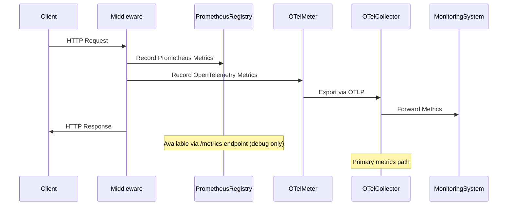

# Design Document

## Overview

This design implements standardized HTTP request metrics for the GlobeCo Security Service using a dual metrics system that feeds the OpenTelemetry Collector directly while maintaining a Prometheus /metrics endpoint for debugging. The implementation uses FastAPI middleware to collect three core metrics: request totals, request duration, and in-flight requests. Based on lessons learned from previous implementations, this design ensures metrics appear in the monitoring infrastructure by implementing both Prometheus and OpenTelemetry metric recording simultaneously.

## Architecture

### High-Level Architecture

```mermaid
graph TB
    A[HTTP Request] --> B[FastAPI Application]
    B --> C[EnhancedHTTPMetricsMiddleware]
    C --> D[Request Processing]
    D --> E[Response]
    
    C --> F[Prometheus Metrics Registry]
    C --> G[OpenTelemetry Metrics]
    
    F --> H[/metrics Endpoint]
    G --> I[OTLP Exporter]
    I --> J[OpenTelemetry Collector]
    J --> K[Monitoring System]
    
    H --> L[Debug/Backup Access]
    
    style J fill:#e1f5fe
    style K fill:#e8f5e8
    style L fill:#fff3e0
```

### Metrics Flow Architecture



## Components and Interfaces

### 1. Core Monitoring Module (`src/core/monitoring.py`)

**Purpose**: Central module containing all metrics definitions and collection logic.

**Key Components**:
- Dual metrics registry (Prometheus + OpenTelemetry)
- Metric creation utilities with duplicate prevention
- Global metrics instances for HTTP monitoring

**Interfaces**:
```python
# Prometheus Metrics
HTTP_REQUESTS_TOTAL: Counter
HTTP_REQUEST_DURATION: Histogram  
HTTP_REQUESTS_IN_FLIGHT: Gauge

# OpenTelemetry Metrics
otel_http_requests_total: OTelCounter
otel_http_request_duration: OTelHistogram
otel_http_requests_in_flight: OTelUpDownCounter

# Utility Functions
_get_or_create_metric(metric_class, name, description, **kwargs)
setup_monitoring(app) -> Instrumentator
```

### 2. HTTP Metrics Middleware (`EnhancedHTTPMetricsMiddleware`)

**Purpose**: FastAPI middleware that intercepts all HTTP requests to collect standardized metrics.

**Key Responsibilities**:
- High-precision request timing using `time.perf_counter()`
- In-flight request tracking with proper increment/decrement
- Route pattern extraction to prevent high cardinality
- Dual metrics recording (Prometheus + OpenTelemetry)
- Comprehensive error handling

**Interface**:
```python
class EnhancedHTTPMetricsMiddleware(BaseHTTPMiddleware):
    async def dispatch(request: Request, call_next: Callable) -> Response
    
    # Private methods for metrics processing
    _record_metrics(method: str, path: str, status: str, duration_ms: float)
    _extract_route_pattern(request: Request) -> str
    _format_status_code(status_code: int) -> str
    _get_method_label(method: str) -> str
```

### 3. Route Pattern Extraction System

**Purpose**: Convert actual URLs to parameterized route patterns to prevent metric cardinality explosion.

**Security Service Specific Patterns**:
```python
# Securities API patterns
/api/v1/securities -> /api/v1/securities
/api/v1/securities/123 -> /api/v1/securities/{id}
/api/v1/securities/search -> /api/v1/securities/search
/api/v2/securities/456/details -> /api/v2/securities/{id}/details

# Health check patterns  
/health -> /health
/health/live -> /health/{check_type}
/health/ready -> /health/{check_type}

# Generic patterns
/metrics -> /metrics
/ -> /
```

**Pattern Extraction Logic**:
```python
def _extract_route_pattern(self, request: Request) -> str:
    # Security service specific routing
    if path.startswith("/api/v1/securities"):
        return self._extract_securities_v1_pattern(path)
    elif path.startswith("/api/v2/securities"):
        return self._extract_securities_v2_pattern(path)
    elif path.startswith("/health"):
        return self._extract_health_pattern(path)
    # ... additional patterns
```

### 4. OpenTelemetry Integration

**Purpose**: Direct integration with OpenTelemetry Collector for primary metrics export.

**Configuration**:
- OTLP exporter configured to send to collector endpoint
- Meter provider setup with appropriate resource attributes
- Metric instruments created with proper naming and units

**Key Integration Points**:
```python
# Meter setup
meter = otel_metrics.get_meter(__name__)

# Metric creation
otel_http_requests_total = meter.create_counter(
    name="http_requests_total",
    description="Total number of HTTP requests",
    unit="1"
)

# Recording with attributes
otel_http_requests_total.add(1, attributes={
    "method": method,
    "path": path, 
    "status": status
})
```

## Data Models

### 1. HTTP Metrics Schema

**Counter Metric: `http_requests_total`**
```yaml
name: http_requests_total
type: counter
description: "Total number of HTTP requests"
labels:
  method: string  # GET, POST, PUT, DELETE, etc.
  path: string    # Route pattern like /api/v1/securities/{id}
  status: string  # HTTP status code as string ("200", "404", "500")
unit: "1"
```

**Histogram Metric: `http_request_duration`**
```yaml
name: http_request_duration
type: histogram
description: "HTTP request duration in milliseconds"
labels:
  method: string  # GET, POST, PUT, DELETE, etc.
  path: string    # Route pattern like /api/v1/securities/{id}
  status: string  # HTTP status code as string ("200", "404", "500")
unit: "ms"
buckets: [5, 10, 25, 50, 100, 250, 500, 1000, 2500, 5000, 10000]
```

**Gauge Metric: `http_requests_in_flight`**
```yaml
name: http_requests_in_flight
type: gauge
description: "Number of HTTP requests currently being processed"
labels: []  # No labels to avoid cardinality issues
unit: "1"
```

### 2. Route Pattern Data Model

**Route Pattern Structure**:
```python
@dataclass
class RoutePattern:
    original_path: str      # /api/v1/securities/123
    pattern: str           # /api/v1/securities/{id}
    parameters: Dict[str, str]  # {"id": "123"}
    api_version: str       # "v1" or "v2"
    resource_type: str     # "securities", "health", etc.
```

### 3. Metrics Recording Context

**Request Context Data**:
```python
@dataclass
class MetricsContext:
    start_time: float      # High-precision start time
    method: str           # Normalized HTTP method
    path_pattern: str     # Extracted route pattern
    status_code: int      # HTTP response status
    duration_ms: float    # Request duration in milliseconds
    in_flight_tracked: bool  # Whether in-flight was incremented
```

## Error Handling

### 1. Metrics Recording Failures

**Strategy**: Graceful degradation - never fail request processing due to metrics issues.

**Implementation**:
```python
def _record_metrics(self, method: str, path: str, status: str, duration_ms: float):
    # Prometheus metrics with error handling
    try:
        HTTP_REQUESTS_TOTAL.labels(method=method, path=path, status=status).inc()
    except Exception as e:
        logger.error("Failed to record Prometheus counter", error=str(e))
    
    # OpenTelemetry metrics with error handling
    try:
        otel_http_requests_total.add(1, attributes={"method": method, "path": path, "status": status})
    except Exception as e:
        logger.error("Failed to record OpenTelemetry counter", error=str(e))
```

### 2. In-Flight Tracking Consistency

**Problem**: Ensuring in-flight gauge is properly decremented even when exceptions occur.

**Solution**: Use try/finally blocks with tracking flags:
```python
in_flight_incremented = False
try:
    HTTP_REQUESTS_IN_FLIGHT.inc()
    in_flight_incremented = True
    # Process request
finally:
    if in_flight_incremented:
        HTTP_REQUESTS_IN_FLIGHT.dec()
```

### 3. Duplicate Metrics Registration

**Problem**: Module reloading or circular imports causing duplicate registration errors.

**Solution**: Metrics registry with existence checking:
```python
_METRICS_REGISTRY = {}

def _get_or_create_metric(metric_class, name, description, **kwargs):
    if name in _METRICS_REGISTRY:
        return _METRICS_REGISTRY[name]
    
    try:
        metric = metric_class(name, description, **kwargs)
        _METRICS_REGISTRY[name] = metric
        return metric
    except ValueError as e:
        if "Duplicated timeseries" in str(e):
            # Return dummy metric to prevent errors
            return DummyMetric()
        raise
```

### 4. OpenTelemetry Initialization Failures

**Problem**: OpenTelemetry SDK not properly configured or collector unavailable.

**Solution**: Fallback to dummy metrics with logging:
```python
try:
    meter = otel_metrics.get_meter(__name__)
    otel_http_requests_total = meter.create_counter(...)
except Exception as e:
    logger.error(f"Failed to create OpenTelemetry metrics: {e}")
    otel_http_requests_total = DummyOTelMetric()
```

## Testing Strategy

### 1. Unit Testing Approach

**Metrics Collection Testing**:
- Mock OpenTelemetry components to prevent network calls
- Verify Prometheus metrics are properly incremented
- Test route pattern extraction with various URL formats
- Validate error handling doesn't break request processing

**Test Environment Setup**:
```python
@pytest.fixture(autouse=True)
def mock_opentelemetry():
    with patch('src.core.monitoring.otel_http_requests_total'), \
         patch('src.core.monitoring.otel_http_request_duration'), \
         patch('src.core.monitoring.otel_http_requests_in_flight'):
        yield
```

### 2. Integration Testing

**Dual Metrics System Validation**:
- Verify both Prometheus and OpenTelemetry metrics are recorded
- Test that metric values are identical between systems
- Validate /metrics endpoint returns expected format
- Confirm OpenTelemetry export to collector works

**Test Scenarios**:
```python
def test_dual_metrics_recording():
    # Make HTTP request
    response = client.get("/api/v1/securities/123")
    
    # Verify Prometheus metrics
    assert prometheus_counter.labels(...).get() == 1
    
    # Verify OpenTelemetry metrics were called
    mock_otel_counter.add.assert_called_with(1, attributes=...)
```

### 3. Load Testing

**Consistency Validation**:
- Generate high request volume
- Verify metrics counts match actual requests
- Test in-flight gauge accuracy under concurrent load
- Validate no metric recording failures under stress

### 4. Route Pattern Testing

**Pattern Extraction Validation**:
```python
@pytest.mark.parametrize("input_path,expected_pattern", [
    ("/api/v1/securities/123", "/api/v1/securities/{id}"),
    ("/api/v1/securities/search", "/api/v1/securities/search"),
    ("/health/live", "/health/{check_type}"),
])
def test_route_pattern_extraction(input_path, expected_pattern):
    # Test pattern extraction logic
```

## Performance Considerations

### 1. Timing Precision

**Requirement**: Microsecond-level timing accuracy for request duration.

**Implementation**: Use `time.perf_counter()` for high-precision monotonic timing:
```python
start_time = time.perf_counter()
# ... process request ...
duration_ms = (time.perf_counter() - start_time) * 1000
```

### 2. Metrics Recording Overhead

**Strategy**: Minimize performance impact of metrics collection.

**Optimizations**:
- Pre-compile route pattern regex
- Cache normalized method/status strings
- Use efficient label value extraction
- Avoid string formatting in hot paths

### 3. Memory Usage

**Concern**: Prevent unbounded memory growth from high-cardinality metrics.

**Mitigation**:
- Strict route pattern parameterization
- Limited set of valid HTTP methods and status codes
- Sanitization of unknown routes
- Regular monitoring of metric cardinality

### 4. Concurrent Request Handling

**Challenge**: Accurate in-flight tracking with async request processing.

**Solution**: Thread-safe gauge operations with proper increment/decrement pairing:
```python
# Atomic operations for in-flight tracking
HTTP_REQUESTS_IN_FLIGHT.inc()  # Thread-safe increment
try:
    # Process request
finally:
    HTTP_REQUESTS_IN_FLIGHT.dec()  # Always decrement
```

## Deployment Configuration

### 1. Single-Process Requirement

**Rationale**: Consistent metrics require single-process deployment to avoid split counters.

**Configuration**:
```bash
# Use Uvicorn directly (not Gunicorn with workers)
uvicorn src.main:app --host 0.0.0.0 --port 8088
```

**Dockerfile**:
```dockerfile
CMD ["/app/start-production.sh"]
# start-production.sh uses uvicorn directly, not gunicorn --workers
```

### 2. OpenTelemetry Configuration

**Environment Variables**:
```bash
OTEL_EXPORTER_OTLP_ENDPOINT=http://otel-collector:4317
OTEL_SERVICE_NAME=security-service
OTEL_RESOURCE_ATTRIBUTES=service.name=security-service,service.version=1.0.0
```

**SDK Configuration**:
```python
from opentelemetry.sdk.metrics import MeterProvider
from opentelemetry.exporter.otlp.proto.grpc.metric_exporter import OTLPMetricExporter

# Configure OTLP exporter for direct collector feeding
otlp_exporter = OTLPMetricExporter(
    endpoint="http://otel-collector:4317",
    insecure=True
)

meter_provider = MeterProvider(
    metric_readers=[PeriodicExportingMetricReader(otlp_exporter)]
)
```

### 3. Health Check Integration

**Enhanced Health Endpoints**:
```python
@app.get("/health/live")
async def health_live():
    return {
        "status": "healthy",
        "requests_in_flight": HTTP_REQUESTS_IN_FLIGHT._value._value
    }
```

## Security Service Customization

### 1. API Route Patterns

**Securities API v1**:
- `GET /api/v1/securities` → `/api/v1/securities`
- `GET /api/v1/securities/{id}` → `/api/v1/securities/{id}`
- `POST /api/v1/securities` → `/api/v1/securities`
- `PUT /api/v1/securities/{id}` → `/api/v1/securities/{id}`

**Securities API v2**:
- `GET /api/v2/securities/search` → `/api/v2/securities/search`
- `GET /api/v2/securities/{id}/details` → `/api/v2/securities/{id}/details`

### 2. Custom Route Extraction

```python
def _extract_securities_v1_pattern(self, path: str) -> str:
    parts = path.split("/")
    if len(parts) == 4:  # /api/v1/securities
        return "/api/v1/securities"
    elif len(parts) == 5:  # /api/v1/securities/{id}
        return "/api/v1/securities/{id}"
    return "/api/v1/securities/unknown"

def _extract_securities_v2_pattern(self, path: str) -> str:
    parts = path.split("/")
    if len(parts) >= 5 and parts[4] == "search":
        return "/api/v2/securities/search"
    elif len(parts) == 6:  # /api/v2/securities/{id}/details
        return "/api/v2/securities/{id}/details"
    return "/api/v2/securities/unknown"
```

## Monitoring and Observability

### 1. Metrics Validation

**Automated Checks**:
- Verify metrics appear in both Prometheus and OpenTelemetry
- Validate metric values are identical between systems
- Monitor for metrics recording failures in logs
- Alert on high cardinality metrics

### 2. Debug Capabilities

**Debug Endpoints**:
- `/metrics` - Prometheus format metrics for debugging
- `/health/live` - Include current in-flight count
- Structured logging for all metrics operations

**Troubleshooting Queries**:
```promql
# Verify metrics are being recorded
http_requests_total{service="security-service"}

# Check request rate
rate(http_requests_total{service="security-service"}[1m])

# Monitor in-flight requests
http_requests_in_flight{service="security-service"}
```

This design ensures robust, performant HTTP metrics collection that feeds the OpenTelemetry Collector as the primary path while maintaining debugging capabilities through the /metrics endpoint. The dual metrics system guarantees visibility in the monitoring infrastructure regardless of collection method changes.